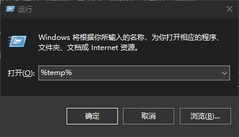
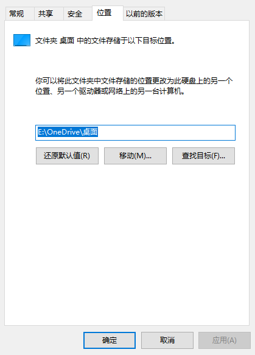
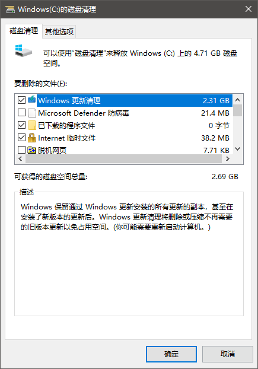
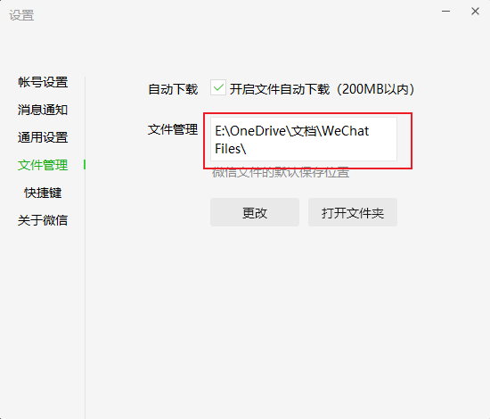
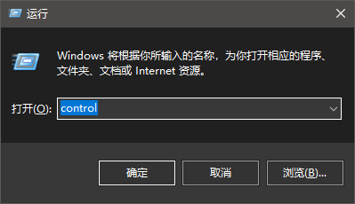
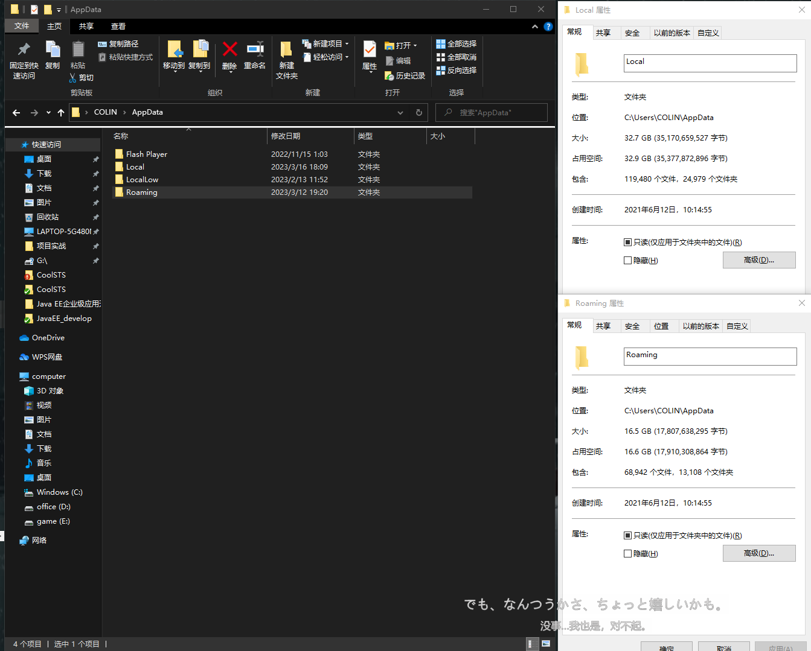

# 清理C盘教程

> 本教程由 :palm_tree:`ColinCora`书写,Q`3300519161`

## 目录

[TOC]

## 第一部分：temp文件

> `Win+R` 输入 `%temp%` 进入temp文件
>
> `介绍：`temp（临时文件夹temporary），位于`C:\Documents and Settings\Administrator\Local Settings\`内。很多临时文件放在这里，用来收藏夹，浏览网页的临时文件，编辑文件等。
>
> 临时文件夹里的都可以删除，只是有些可能删不掉，因为有些程序正在使用，如后台程序你把所有程序都关掉，然后删除所有能删除的。
>
> 或者你可以直接用QQ电脑管家或360电脑管家的垃圾清理功能，这个文件夹里都是某些程序运行时产生的垃圾，可以删除。
>
> `弊端：`这是许多软件都存在的文件夹。它是临时文件夹。也是一种缓存文件夹。是可以删除的。但是也是不可或缺的。一旦你删除了，可能导致对应的软件开启非常的缓慢。这是因为软件在重新缓存一些文件。所以会慢。

> 或者 在系统设置的环境变量里面，把temp文件夹该到别的盘
>
> 1.我的电脑右键`属性`->`高级系统设置`->`环境变量`
>
> 
>
> 

## 第二部分：转移桌面地址+回收站设置

> ## 一、转移桌面地址
>
> 在你电脑的其他盘【容量较大的盘】里`新建一个Desk文件夹` 一定要建好文件夹
>
> #### 1.然后打开我的`文件夹管理器`
>
> 
>
> #### 2.`属性` ->`位置`  然后把桌面位置改为刚才新建的文件夹
>
> 
>
> ## 二、转移回收站设置
>
> 每个盘都有回收站的,并不是只有C盘有,默认每个盘都有回收站的,你删除哪个盘的文件,就回收到响应的盘的回收站.
> 但可以对回收站进行设置:
> 1 可以设置为直接删除,不回收.(删除的时候按住shift,可以达到直接删除的目的)
> 2 可以设置回收站的容量大小,当删除的文件大于回收站的容量时,就直接删除掉不放到回收站中.
> 设置回收站的方法是,对回收站点`右键`,然后`设置`.
>
> 
>
> 
>
> ## 三、以此类推
>
> 照着这个思路以此类推：`凡是有特殊图标的文件夹比如我的音乐，我的文档等等，打开属性后是可以修改位置的`
>
> 

## 第三部分：磁盘清理

> 主要用来清理Windows更新文件和一些磁盘垃圾
>
> #### 1.我的电脑 找到C盘右键`属性`->`磁盘清理`->`清理系统文件夹`->`Windows更新清理`
>
> 
>
> 

## 第四部分：更改各个应用存储缓存位置

> 比如`QQ`啊或者`微信` 等一些软件默认存储位置就在C盘
>
> 我们可以通过打开响应软件设置来更改位置
>
> 例如微信：`设置`->`文件管理`->`更改位置`
>
> 

## 第五部分：使用第三方清理工具进行清理

> #### 一、火绒
>
> 我们可以用火绒清理垃圾模块来进行磁盘垃圾扫描
>
> 
>
> #### 二、Dism++
>
> 打开`Dism`->`空间回收`->`默认`->`扫描`->`清理`
>
> 
>
> 
>
> 
>
> 
>
> Dism++下载地址：链接：https://pan.baidu.com/s/1ix-Wk7ZMYgEkgU1D9x5j6A 
> 提取码：5fiz 

## 第六部分：更改软件默认安装地址

> 有一些软件默认安装在了C盘，这就会导致软件不仅占用C盘位置还会不断产生响应生成文件
>
> 如何更改呢？
>
> #### 1.Win+R输入`control`
>
> 
>
>  2.`程序和功能`->`卸载默认装在C盘的软件再安装`【如果安装是独立于系统盘的可以整体剪切到其他空闲盘】 与此同时`我们可以在这个页面卸载一些捆绑软件，比如XXX阅读器，XXX桌面等`
>
> 

## *第七部分： 高阶清理

> 需要较强的`磁盘清理经验`，小白谨慎操作
>
> 1.Win+R输入`appdata`->然后这个目录里面，一个是`Local文件夹`，一个是`Roaming文件夹`,进去慢慢手动清理吧。一般人起码有十几到二十G左右....
>
> 

